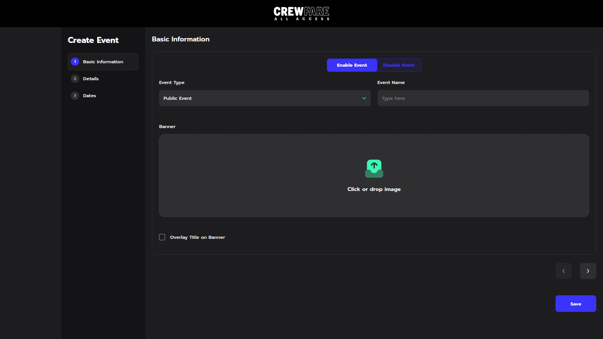
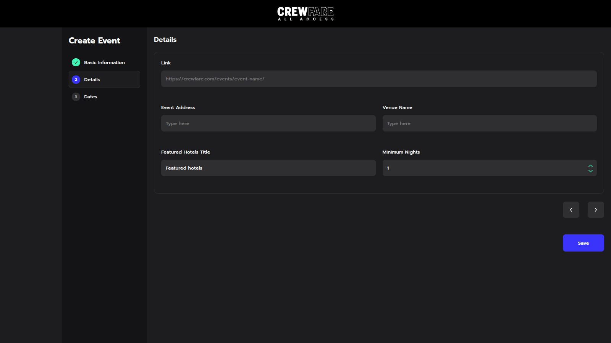
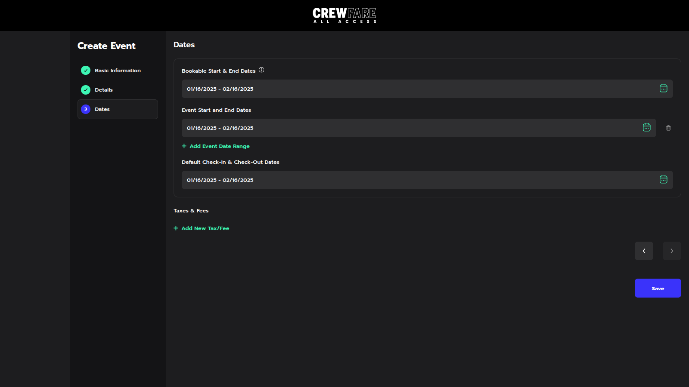

# React Event Management Application

This is a React-based event management application built using TypeScript, SCSS, and CSS Modules. It features a user-friendly interface for creating and managing events, with functionalities like uploading banners, setting event details, and more. The application is well-tested with Jest and includes component documentation using Storybook.

## Table of Contents

- [Running the Project](#running-the-project)
- [Testing the Project](#testing-the-project)
- [Using Storybook](#using-storybook)
- [Application Features](#application-features)
- [Screenshots](#screenshots)
- [Tech Stack](#tech-stack)

---

## Running the Project

1. **Clone the Repository**

   ```bash
   git clone <repository-url>
   cd <repository-folder>
   ```

2. **Install Dependencies**
   Make sure you have Node.js and npm installed. Then run:

   ```bash
   npm install
   ```

3. **Run the Application**
   Start the development server:
   ```bash
   npm start
   ```
   The application will be available at `http://localhost:3000/`.

---

## Testing the Project

The application uses Jest for unit and integration tests.

1. **Run Tests**

   ```bash
   npm test
   ```

2. **View Test Coverage**
   To generate a test coverage report, run:
   ```bash
   npm test -- --coverage
   ```
   The coverage report will be available in the `coverage/` directory.

---

## Using Storybook

Storybook is used to document and visually test components.

1. **Start Storybook**

   ```bash
   npm run storybook
   ```

   Storybook will be available at `http://localhost:6006/`.

2. **Build Storybook**
   To generate a static Storybook build:
   ```bash
   npm run build-storybook
   ```
   The static files will be available in the `storybook-static/` directory.

---

## Application Features

- **Event Creation**: Users can create public or private events.
- **Banner Upload**: Upload and preview event banners.
- **Event Details**: Add event address, venue name, and featured hotels.
- **Date Selection**: A user-friendly calendar interface to easily select dates for key actions, making scheduling and date management seamless.

---

## Screenshots

### Basic Information Page



### Details Page



### Dates Page



---

## Tech Stack

- **Frontend**: React, TypeScript
- **Styling**: SCSS, CSS Modules
- **Testing**: Jest
- **Component Documentation**: Storybook
- **Packages Used**:
  - `uuid` for generating unique identifiers.
  - `react-calendar` for date selection functionality.

---

## Contributing

1. Fork the repository.
2. Create a new branch:
   ```bash
   git checkout -b feature-name
   ```
3. Commit your changes:
   ```bash
   git commit -m 'Add new feature'
   ```
4. Push to the branch:
   ```bash
   git push origin feature-name
   ```
5. Open a pull request.
